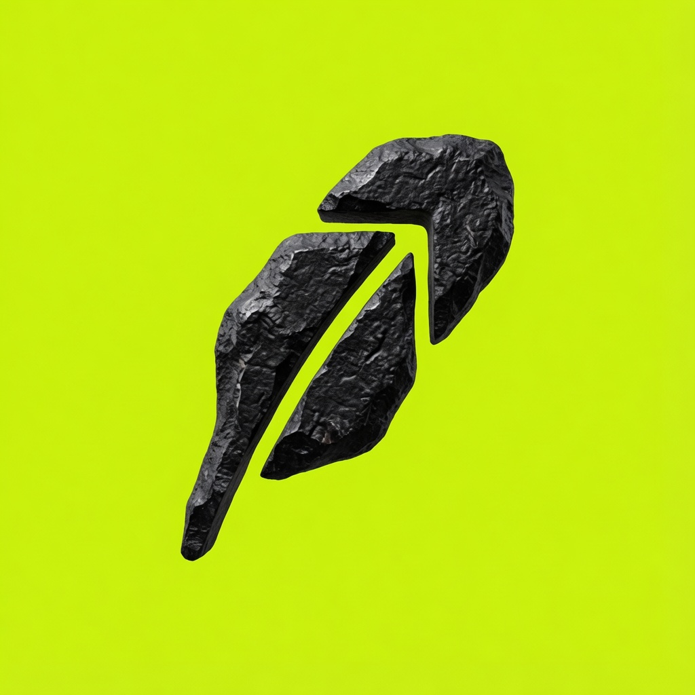

# Rockhood Launchpad

**The first fair launch platform on Robinhood Chain.**

Launch any token in seconds — no code needed. Bonding curve powered with auto-liquidity on Uniswap.



## 🚀 Quick Start

```bash
# Install a simple static server
npx serve .

# Or use Python
python3 -m http.server 8080
```

Then open [http://localhost:3000](http://localhost:3000) (or port 8080 for Python).

## 📦 Deploy for Free

### Vercel (Recommended)

1. Push this folder to a GitHub repo
2. Go to [vercel.com](https://vercel.com) → Import Project
3. Select the repo → Deploy
4. Done! Your site is live.

Or use the CLI:

```bash
npm i -g vercel
vercel
```

### Netlify

1. Go to [app.netlify.com](https://app.netlify.com)
2. Drag & drop this entire folder onto the deploy area
3. Done!

Or connect your GitHub repo for auto-deploys.

### GitHub Pages

1. Push to a GitHub repo
2. Go to Settings → Pages
3. Set Source to "Deploy from a branch" → `main` → `/ (root)`
4. Your site will be live at `https://<username>.github.io/<repo>`

## 🗂️ Project Structure

```
rockhood-site/
├── index.html      # Main site (single page)
├── logo.jpg        # Logo / favicon
├── package.json    # npm scripts
└── README.md       # This file
```

## ⚙️ Tech Stack

- **Vanilla HTML/CSS/JS** — no frameworks, no build step
- **ethers.js v6** (CDN) — wallet connection
- **Inter** font (Google Fonts)
- Mobile responsive, dark theme

## 🔗 Links

- Twitter: [@Rockhood_](https://x.com/Rockhood_)
- Website: Coming soon

## 📄 License

© 2026 Rockhood. All rights reserved.
